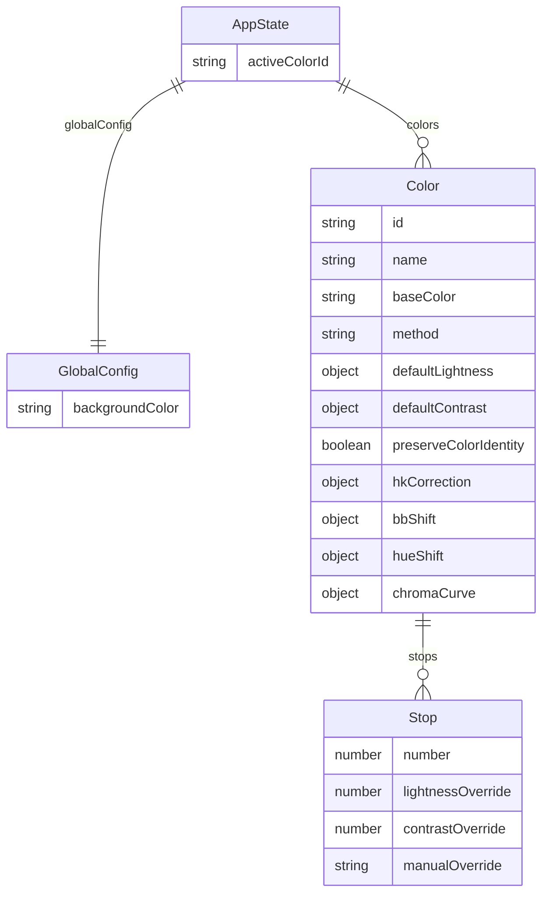

# refactor: Remove groups, flatten to per-color model

## Overview

Remove the `ColorGroup` concept from Octarine entirely. Each color becomes fully independent — owning its own method, default lightness/contrast values, stops, corrections, and curves. The UI simplifies from group-based navigation to a flat color list with single-color editing.

This is a structural simplification, not a feature addition. The only new behavior is "Duplicate Color."

## Problem Statement

The groups model forces colors to share lightness/contrast defaults based on the flawed assumption that shared OKLCH lightness creates visual harmony across hues. Different hues have vastly different gamut shapes, so the same lightness produces different chroma levels. The `preserveColorIdentity` feature further breaks shared-lightness consistency. Groups add UI complexity (accordions, strips, group management) without delivering value. (see origin: `docs/brainstorms/2026-03-26-remove-groups-requirements.md`)

## Proposed Solution

1. Absorb `GroupSettings` fields (`method`, `defaultLightness`, `defaultContrast`) into `Color`
2. Replace `AppState.groups: ColorGroup[]` with `AppState.colors: Color[]`
3. Rewrite the UI: left panel = color list + core settings, middle = one color's swatches, right = advanced settings
4. Add v6→v7 state migration that flattens groups into colors
5. Add "Duplicate Color" action

## Technical Approach

### Architecture



**Types removed:** `ColorGroup`, `GroupSettings`, `GlobalSettings` (alias), `EffectiveSettings`
**Types modified:** `Color` (gains `method`, `defaultLightness`, `defaultContrast`; loses `methodOverride`), `AppState` (gains `colors[]`, `activeColorId`; loses `groups[]`, `activeGroupId`, `expandedGroupId`)
**New helper type:** `ColorSettings = { method: ColorMethod; defaultLightness: Record<number, number>; defaultContrast: Record<number, number>; backgroundColor: string }` — replaces `EffectiveSettings` for `generateColorPalette` and `createFigmaVariables`

### Implementation Phases

#### Phase 1: Types & Migration (`lib/types.ts`)

**Goal:** New type definitions and state migration. Everything else still compiles against old types until updated.

**Tasks:**

- [x] Add `method: ColorMethod`, `defaultLightness: Record<number, number>`, `defaultContrast: Record<number, number>` to `Color` type (`lib/types.ts:130`)
- [x] Remove `methodOverride` from `Color` type (`lib/types.ts:137`)
- [x] Remove `ColorGroup` type (`lib/types.ts:191`), `GroupSettings` type (`lib/types.ts:161`), `GlobalSettings` alias (`lib/types.ts:170`), `EffectiveSettings` type (`lib/types.ts:184`)
- [x] Add `ColorSettings` type: `{ method: ColorMethod; defaultLightness: Record<number, number>; defaultContrast: Record<number, number>; backgroundColor: string }`
- [x] Change `AppState` (`lib/types.ts:201`): remove `groups`, `activeGroupId`, `expandedGroupId`; add `colors: Color[]`, `activeColorId: string | null`
- [x] Remove `createDefaultGroupSettings()` (`lib/types.ts:246`), `createDefaultGroup()` (`lib/types.ts:265`)
- [x] Add `createDefaultColor(id: string, name: string): Color` — creates a color with `DEFAULT_LIGHTNESS`, `DEFAULT_CONTRAST`, default stops, `method: 'lightness'`
- [x] Rewrite `createInitialAppState()` (`lib/types.ts:275`) — creates one default color, sets `activeColorId` to that color's id
- [x] Bump `STORAGE_VERSION` to 7 (`lib/types.ts:289`)
- [x] Add v6→v7 migration handler in `migrateState()` (`lib/types.ts:321`): when `persisted.version === 6`, iterate `state.groups`, flatten each group's `colors` into a single array, for each color: set `color.method = color.methodOverride ?? group.settings.method`, set `color.defaultLightness = group.settings.defaultLightness`, set `color.defaultContrast = group.settings.defaultContrast`, delete `color.methodOverride` using rest destructuring pattern (see learnings: `docs/solutions/code-quality/removing-curve-based-stop-values.md`)
- [x] Set `activeColorId = flattenedColors[0]?.id ?? null` in the migration
- [x] Update the shape validator at end of `migrateState()` (`lib/types.ts:424`): check `Array.isArray(candidate.colors)` instead of `Array.isArray(candidate.groups)`
- [x] Validate at entry of v6→v7 handler: confirm `state.groups` is an array before iterating

**Success criteria:** `npm run typecheck` passes. Migration unit-testable in isolation.

#### Phase 2: Generation & Export Pipeline (`lib/color-utils.ts`, `lib/export-utils.ts`, `lib/figma-utils.ts`)

**Goal:** Update all functions that consumed `EffectiveSettings` or `ColorGroup[]`.

**Tasks:**

- [x] Update `generateColorPalette()` signature (`lib/color-utils.ts:87`): change from `(color: Color, globalSettings: EffectiveSettings)` to `(color: Color, colorSettings: ColorSettings)`. Internal changes: `globalSettings.method` → `color.method`, `globalSettings.defaultLightness` → `color.defaultLightness`, `globalSettings.defaultContrast` → `color.defaultContrast`, `globalSettings.backgroundColor` → `colorSettings.backgroundColor`. Remove the `color.methodOverride ?? globalSettings.method` fallback at line 94 — just use `color.method` directly.
- [x] Update `prepareExportData()` signature (`lib/export-utils.ts:24`): change from `(groups: ColorGroup[], globalConfig: GlobalConfig)` to `(colors: Color[], globalConfig: GlobalConfig)`. Body: remove group iteration, iterate `colors` directly, build `ColorSettings` per color as `{ ...pick(color, 'method', 'defaultLightness', 'defaultContrast'), backgroundColor: globalConfig.backgroundColor }`
- [x] Update `createFigmaVariables()` (`lib/figma-utils.ts`): change parameter from `Array<{ color: Color; settings: EffectiveSettings }>` to `(colors: Color[], backgroundColor: string)`. Build `ColorSettings` per color internally.
- [x] Update imports in all three files: remove `ColorGroup`, `GroupSettings`, `EffectiveSettings`; add `ColorSettings`

**Success criteria:** `npm run typecheck` passes. Export produces identical output for identical input data.

#### Phase 3: Plugin Sandbox (`code.ts`)

**Goal:** Update the Figma-side message handler.

**Tasks:**

- [x] Update `PluginMessage` type (`code.ts:12`): change `create-variables` branch from `{ groups: ColorGroup[] }` to `{ colors: Color[] }`
- [x] Update `create-variables` handler (`code.ts:49-64`): remove group iteration loop, pass `msg.colors` and `msg.globalConfig.backgroundColor` to `createFigmaVariables()` directly
- [x] Update `save-state` handler: no change needed (already sends `AppState` opaquely)
- [x] Update `load-state` handler: no change needed (`migrateState` handles version differences)
- [x] Update imports: remove `ColorGroup`; import `Color` if not already imported

**Success criteria:** `npm run typecheck` passes. `create-variables` message works with new payload shape.

#### Phase 4: UI State Management (`ui.tsx`)

**Goal:** Rewrite the state management layer. This is the largest change.

**Tasks:**

- [x] Update imports: remove `ColorGroup`, `createDefaultGroupSettings`, `createDefaultGroup`; add `createDefaultColor`
- [x] Update state destructuring (`ui.tsx:33`): `const { colors, activeColorId } = state` (remove `groups`, `activeGroupId`, `expandedGroupId`)
- [x] Replace derived values (`ui.tsx:36-56`):
  - Remove `activeGroup`, `activeGroupColors`, `mergedSettings` derivations
  - Add `activeColor = colors.find(c => c.id === activeColorId) ?? null`
  - Add `colorSettings = useMemo(() => activeColor ? { method: activeColor.method, defaultLightness: activeColor.defaultLightness, defaultContrast: activeColor.defaultContrast, backgroundColor: state.globalConfig.backgroundColor } : null, [activeColor, state.globalConfig.backgroundColor])`
- [x] Keep `activeColorId` selection changes outside undo history — use `replaceState()` (from `useHistory`) for selection changes only, use `setState()` for data changes. This preserves the current behavior where clicking a color is not undo-able.
- [x] Auto-select logic (`ui.tsx:64-78`): simplify to single `useEffect` — if `activeColorId` is null or points to a deleted color, select `colors[0]?.id ?? null`
- [x] Remove all group callbacks (`ui.tsx:148-197`): `selectGroup`, `toggleGroupExpansion`, `addGroup`, `updateGroup`, `deleteGroup`
- [x] Rewrite color operations (`ui.tsx:202-234`):
  - `addColor()`: create new color via `createDefaultColor()`, append to `colors[]`, auto-select it
  - `updateColor(colorId, updates)`: map over `colors[]`, spread updates onto matching color
  - `removeColor(colorId)`: filter `colors[]`, if deleted color was active, select color at same index or previous (if it was last), if list is empty set `activeColorId = null`
  - `duplicateColor(colorId)`: deep copy color with new id, label = `originalName + " copy"`, insert immediately after the original in `colors[]`, auto-select the duplicate
- [x] Update `createVariables()` (`ui.tsx:239-251`): send `{ type: 'create-variables', colors, globalConfig }` instead of `{ type: 'create-variables', groups }`
- [x] Update left panel props (`ui.tsx:268-278`): pass `colors`, `activeColorId`, `activeColor`, `onSelectColor`, `onUpdateColor`, `onAddColor`, `onDeleteColor`, `onDuplicateColor`
- [x] Update middle panel rendering (`ui.tsx:280-309`): render only `activeColor`'s stops, remove `activeGroupColors.map()` loop, keep `ColorRow` component for each stop
- [x] Update `ExportModal` props: change from `groups` to `colors`

**Success criteria:** `npm run typecheck` passes. All user flows work: add, select, edit, duplicate, delete, undo/redo.

#### Phase 5: UI Components

**Goal:** Update all child components.

**Tasks:**

##### LeftPanel (`components/panels/LeftPanel.tsx`) — complete rewrite
- [x] New props: `colors: Color[]`, `activeColorId: string | null`, `activeColor: Color | null`, `onSelectColor`, `onUpdateColor`, `onAddColor`, `onDeleteColor`, `onDuplicateColor`
- [x] Render flat color list (each row: color dot + name, click to select, highlight active)
- [x] Below list: "Add Color" button
- [x] Below button: if `activeColor` exists, render base color picker, method toggle, `DefaultsTable`
- [x] Remove all group-related rendering (GroupAccordionItem loop, "Add Group" button)

##### DefaultsTable (`components/groups/DefaultsTable.tsx`) — moved, props changed
- [x] Move from `components/groups/` to `components/panels/` or `components/color-settings/` (wherever makes sense in the component tree)
- [x] Change props from `{ settings: GroupSettings, onUpdate: (settings: GroupSettings) => void }` to `{ color: Color, onUpdate: (updates: Partial<Color>) => void }`
- [x] When "Add Stop" adds a stop number: add to both `Color.defaultLightness`/`defaultContrast` (with interpolated values) AND to `Color.stops[]` (new Stop object). When removing a stop: remove from both.
- [x] Internal logic stays the same — it already handles method toggle, value editing, interpolation

##### GroupAccordionItem (`components/groups/GroupAccordionItem.tsx`) — delete entirely
- [x] Delete file
- [x] Remove from `components/groups/index.ts`

##### ExportModal (`components/export/ExportModal.tsx`)
- [x] Change props: `groups: ColorGroup[]` → `colors: Color[]`
- [x] Update `prepareExportData()` call to pass `colors` instead of `groups`
- [x] Update color count: `colors.length` instead of reducing over groups

##### ColorRow (`components/colors/ColorRow.tsx`)
- [x] Add Duplicate button next to existing Delete button
- [x] Receive `onDuplicate` callback prop

##### RightSettingsPanel / ColorSettingsContent
- [x] No structural changes needed — already per-color
- [x] Remove any reference to `EffectiveSettings` if present
- [x] Confirm "Preserve Color Identity" toggle is in the right panel (it should be, alongside HK/BB)

##### Cleanup
- [x] Delete `components/groups/GroupAccordionItem.tsx`
- [x] Delete or repurpose `components/groups/index.ts`
- [x] Delete `components/color-settings/ColorSettingsPopup.tsx` (unused — dead code from prior design)

**Success criteria:** Full plugin builds (`npm run build`), all panels render correctly.

#### Phase 6: Documentation & Cleanup

**Tasks:**

- [x] Update `docs/FEATURES.md`: remove all group references, update UI layout description, update generation methods section
- [x] Update `PLAN.md`: remove group references from Import Figma Variables section
- [x] Add entry to `docs/removed-features.md` for Groups: What It Did, Why Removed, Current Behavior, If Revisiting
- [x] Update `components/CLAUDE.md` if it references group components
- [x] Update root `CLAUDE.md` UI layout diagram
- [x] Grep codebase for any remaining "group" references: `grep -ri "group" --include="*.ts" --include="*.tsx"`

**Success criteria:** `npm run validate` passes. No stale group references in docs or code.

## System-Wide Impact

### Interaction Graph

```
User clicks color in LeftPanel
  → onSelectColor(id) fires
  → ui.tsx replaceState() updates activeColorId
  → React re-renders: LeftPanel highlights new color, shows its settings
  → Middle panel re-renders with new color's swatches via generateColorPalette()
  → RightSettingsPanel re-renders with new color's advanced settings

User edits defaults table value
  → DefaultsTable calls onUpdate({ defaultLightness: {...} })
  → ui.tsx setState() updates color in colors[]
  → useHistory captures snapshot (undoable)
  → Middle panel re-renders swatches
  → save-state message sent to code.ts → persisted to Figma storage

User exports to Figma variables
  → ExportModal → createVariables(collectionName)
  → postMessage({ type: 'create-variables', colors, globalConfig, collectionName })
  → code.ts iterates colors, builds ColorSettings per color
  → createFigmaVariables(colors, backgroundColor)
  → generateColorPalette(color, colorSettings) per color
  → Figma API: create/update variables
```

### Error Propagation

- **Migration failure**: `migrateState()` returns `createInitialAppState()` as fallback. User loses saved state but gets a working plugin. This is the existing pattern.
- **Invalid activeColorId after undo**: `useEffect` auto-corrects to `colors[0]?.id ?? null`.
- **Empty colors array**: Left panel shows "Add Color" button only. Middle/right panels show empty state.

### State Lifecycle Risks

- **Undo across migration boundary**: Not possible — migration runs on load and `replaceState()` clears history. No risk.
- **activeColorId as local vs AppState**: Selection uses `replaceState()` to avoid polluting undo history. If `replaceState` is not available on `useHistory`, keep `activeColorId` as separate `useState` (same as current `activeSettingsColorId`) with reconciliation after undo.

## Acceptance Criteria

### Functional Requirements

- [x] No `ColorGroup`, `GroupSettings`, or group-related UI remains in the codebase
- [x] Each color independently owns method, defaultLightness, defaultContrast, stops, corrections, curves
- [x] Left panel: flat color list + base color picker + method toggle + defaults table for selected color
- [x] Middle panel: swatches for selected color only
- [x] Right panel: advanced settings (HK/BB, hue shift, chroma, preserve identity) for selected color
- [x] "Add Color" creates a new color with hardcoded defaults
- [x] "Duplicate Color" deep-copies a color, inserts after original, auto-selects it
- [x] "Delete Color" removes color, auto-selects adjacent color or goes to null
- [x] Undo/redo works for data changes (add, edit, delete, duplicate) but NOT for selection changes
- [x] App starts with one default color on first launch
- [x] Export to CSS/JSON/Figma variables works identically (same output for same data)
- [x] Adding a stop via defaults table adds to both `defaultLightness`/`defaultContrast` AND `stops[]`

### Migration Requirements

- [x] `STORAGE_VERSION` = 7
- [x] v6 state (with groups) migrates correctly to v7 (flat colors)
- [x] `methodOverride` resolved: override wins if set, else group method used
- [x] `methodOverride` field stripped from migrated colors
- [x] v1→v5 states still migrate correctly (chain through existing handlers to v6, then v6→v7)
- [x] Corrupt/missing state falls back to `createInitialAppState()`

### Build Requirements

- [x] `npm run typecheck` passes
- [x] `npm run build` produces valid `code.js` and `ui.html`
- [x] `npm run validate` passes

## Dependencies & Prerequisites

- No external dependencies change
- Prior migration chain (v1–v5) must be preserved and verified
- `useHistory` hook's `replaceState` capability needed for selection — verify it exists or implement

## Risk Analysis & Mitigation

| Risk | Likelihood | Impact | Mitigation |
|------|-----------|--------|------------|
| Migration silently drops data | Low | High | Validate input shape before iterating; fallback to `createInitialAppState()` |
| `methodOverride` not stripped | Medium | Medium | Use rest destructuring pattern from curve removal learnings |
| Undo history includes selection | Medium | Low | Use `replaceState()` or keep as local state |
| Export output changes unexpectedly | Low | High | Test: generate palette with known inputs before and after, compare output |
| Stale group references in code | Medium | Low | Final grep audit in Phase 6 |

## Documentation Plan

- `docs/FEATURES.md` — update UI layout, remove group references
- `docs/removed-features.md` — add Groups entry
- `PLAN.md` — update Import Figma Variables section
- `components/CLAUDE.md` — update component tree
- Root `CLAUDE.md` — update UI layout diagram

## Sources & References

### Origin

- **Origin document:** [docs/brainstorms/2026-03-26-remove-groups-requirements.md](docs/brainstorms/2026-03-26-remove-groups-requirements.md) — Key decisions: remove groups entirely (not per-color overrides), flat color list, one color visible at a time, base color picker moves to left panel, new colors use hardcoded defaults

### Internal References

- Type definitions: `lib/types.ts:130` (Color), `lib/types.ts:161` (GroupSettings), `lib/types.ts:191` (ColorGroup), `lib/types.ts:201` (AppState)
- Generation: `lib/color-utils.ts:87` (generateColorPalette)
- Export: `lib/export-utils.ts:24` (prepareExportData)
- Migration: `lib/types.ts:289` (STORAGE_VERSION), `lib/types.ts:321` (migrateState)
- Plugin messages: `code.ts:12` (PluginMessage type), `code.ts:49` (create-variables handler)
- UI state: `ui.tsx:33` (state destructuring), `ui.tsx:148-234` (group/color operations)
- Prior refactor learnings: `docs/solutions/code-quality/removing-curve-based-stop-values.md` — rest destructuring pattern for migration, grep imports before deleting files
- Dead code to remove: `components/color-settings/ColorSettingsPopup.tsx` (unreferenced), `ui.tsx:148 selectGroup` (never called)

### Files Changed (Complete List)

| File | Change |
|------|--------|
| `lib/types.ts` | Major — types, migration, helpers |
| `lib/color-utils.ts` | Moderate — signature, internal reads |
| `lib/export-utils.ts` | Moderate — signature, remove group loop |
| `lib/figma-utils.ts` | Moderate — signature change |
| `code.ts` | Moderate — message type, handler |
| `ui.tsx` | Major — state management rewrite |
| `components/panels/LeftPanel.tsx` | Major — complete rewrite |
| `components/groups/DefaultsTable.tsx` | Moderate — move, prop change |
| `components/groups/GroupAccordionItem.tsx` | Delete |
| `components/groups/index.ts` | Delete or update |
| `components/export/ExportModal.tsx` | Minor — prop change |
| `components/colors/ColorRow.tsx` | Minor — add Duplicate button |
| `components/color-settings/ColorSettingsPopup.tsx` | Delete (dead code) |
| `docs/FEATURES.md` | Update |
| `docs/removed-features.md` | Add entry |
| `PLAN.md` | Update |
| `components/CLAUDE.md` | Update |
| `CLAUDE.md` | Update UI diagram |
